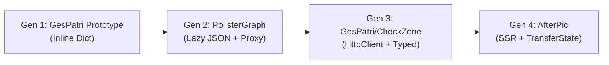

# Angular Signal-Based Translation Services — Cross-Project Analysis

## Executive Summary

Across **7 projects** (9 files), you've iterated on a reactive, signal-based i18n system for Angular that evolved through **4 generations**. Each iteration solved real problems discovered in production, converging on a mature architecture with: lazy-loaded JSON namespaces, recursive proxy fallbacks, typed scope selectors, SSR TransferState hydration, and signal caching.

---

## Evolution Timeline



---

## All Implementations At a Glance

| Feature                      | GesPatri Proto   | PollsterGraph                    | GesPatri Web              | GesPatri Frontend                | CheckZone (Admin/Website)        | AfterPic (duo-fusion)                  | Aura Companion         |
| ---------------------------- | ---------------- | -------------------------------- | ------------------------- | -------------------------------- | -------------------------------- | -------------------------------------- | ---------------------- |
| **Generation**               | 1                | 2                                | 3                         | 3+                               | 3                                | 4 (latest)                             | Hybrid                 |
| **Translations source**      | Inline TS object | Dynamic `import()` JSON          | HttpClient JSON           | HttpClient JSON                  | `fetch()` JSON                   | Dynamic `import()` JSON                | BehaviorSubject (stub) |
| **Namespace/Scope system**   | ❌ Flat keys     | ✅ Scoped (`select()`)           | ✅ Scoped (`select()`)    | ✅ Typed scopes (`I18nScopeMap`) | ✅ Scoped (`select()`)           | ✅ Typed (`I18nTypes`)                 | ❌ Flat keys           |
| **Lazy loading**             | ❌ All inline    | ✅ On `select()`                 | ✅ On `select()`          | ✅ On `select()`                 | ✅ On `loadScope()`              | ✅ On `select()`/`translate()`         | ❌ N/A                 |
| **Recursive proxy**          | ❌               | ✅ `createDictionaryProxy`       | ✅ `createRecursiveProxy` | ✅ `createRecursiveProxy`        | ✅ `createDictionaryProxy`       | ❌ (returns `{}`)                      | ❌                     |
| **`translate()` → Signal**   | ✅ `computed()`  | ✅ `computed()`                  | ❌ (no `translate()`)     | ❌ (no `translate()`)            | ❌ (returns string)              | ✅ `computed()` + cached               | ❌ (returns string)    |
| **`instant()` imperative**   | ❌               | ❌                               | ❌                        | ❌                               | ✅ (`translate()` is imperative) | ✅ `instant()`                         | ✅                     |
| **`select()` typed**         | ❌               | ❌ (returns `any`)               | ❌ (returns `any`)        | ✅ `I18nScopeMap[T]`             | ❌                               | ✅ `I18nTypes[K]`                      | ❌                     |
| **TranslatePipe**            | ❌               | ✅ (impure pipe)                 | ❌                        | ❌                               | ❌                               | ❌                                     | ❌                     |
| **SSR support**              | ❌               | ❌                               | ❌                        | ❌                               | ❌                               | ✅ TransferState + PendingTasks        | ❌                     |
| **`isReady` / `coreLoaded`** | ❌               | ✅ `isReady`                     | ✅ `isLoading`            | ✅ `isLoading`                   | ✅ `isReady`                     | ✅ `coreLoaded`                        | ❌                     |
| **APP_INITIALIZER**          | ❌               | ✅ `preloadCoreScopes()`         | ✅ (constructor)          | ✅ (constructor)                 | ✅ `preloadCoreScopes()`         | ✅ `init()`                            | ❌                     |
| **Language detection**       | Country signal   | Hardcoded `'es'`                 | localStorage + browser    | localStorage + browser           | localStorage + browser           | Cookie → storage → browser → SSR token | Browser detect         |
| **Param interpolation**      | ❌               | ✅ `{{key}}`                     | ❌                        | ❌                               | ❌                               | ✅ `{key}`                             | ✅ `{{key}}`           |
| **Signal caching**           | ❌               | ✅ `scopeCache` (WritableSignal) | ✅ `signalCache`          | ✅ `signalCache`                 | ❌                               | ✅ `signalCache`                       | ❌                     |
| **Loading dedup**            | ❌               | ❌                               | `loadingNamespaces` Set   | `loadingNamespaces` Set          | `scopeCache.has()`               | `loadingPromises` Map                  | `loadingLanguages` Set |
| **Auto-generated types**     | ❌               | ❌                               | ❌                        | ✅ `generate-i18n-types.ts`      | ❌                               | ✅ `generate-i18n-types.ts`            | ❌                     |
| **Fallback lang**            | Country default  | N/A                              | `pt-BR`                   | `pt-BR`                          | `en`                             | `en` (recursive retry)                 | `en`                   |

---

## Key Patterns That Emerged

### 1. Recursive Proxy Fallback (Critical Innovation)

Found in: PollsterGraph, GesPatri (web/frontend), CheckZone

The proxy prevents template crashes when translations haven't loaded yet by returning another proxy for any missing property access. The GesPatri version is the most evolved, handling Angular lifecycle hooks, Promise-like properties (`then`/`catch`), and even `String.prototype` methods.

```
PollsterGraph:  createDictionaryProxy() — wraps real data, falls back to path string
GesPatri/Web:   createRecursiveProxy() — creates an infinite empty proxy chain, returns '' on coercion
```

> [!IMPORTANT]
> The GesPatri `createRecursiveProxy` is the superior version — it handles `Symbol.iterator` (for `@for` loops), caches proxies, and properly skips Angular internals. This should be the foundation.

### 2. Scope/Namespace Architecture

The `select('scope')` pattern evolved from returning `WritableSignal<any>` (PollsterGraph) to returning strongly-typed `Signal<I18nScopeMap[T]>` (GesPatri-frontend) and `Signal<Partial<I18nTypes[K]>>` (AfterPic).

### 3. Dual API Surface: `translate()` + `select()`

- **`translate(key)`**: Returns a `Signal<string>` — ideal for pipes and dynamic keys
- **`select(scope)`**: Returns a `Signal<ScopeObject>` — ideal for `@let t = common()` template patterns
- **`instant(key)`**: Non-reactive imperative access — needed for TS-side logic (toasts, errors)

### 4. SSR TransferState Hydration (AfterPic only)

The most advanced pattern. Translations loaded during SSR are serialized via `TransferState`, then hydrated synchronously on the client to prevent flicker. Uses `PendingTasks` to block server render until translations are ready.

### 5. Auto-Generated Type Interfaces

Both GesPatri-frontend and AfterPic use a `scripts/generate-i18n-types.ts` that reads JSON files and emits TypeScript interfaces, enabling autocompletion on `select('scope')()`.

---

## What a Library Needs (Converged Best-Of)

Based on the evolution, the library should combine:

| Capability                                                           | Source                            |
| -------------------------------------------------------------------- | --------------------------------- |
| `createRecursiveProxy()` with caching, Angular/Promise/String safety | GesPatri-web                      |
| `select<K>(scope)` with generic typed return                         | GesPatri-frontend + AfterPic      |
| `translate(key, params)` returning `Signal<string>` with caching     | AfterPic                          |
| `instant(key, params)` for imperative access                         | AfterPic                          |
| SSR TransferState hydration + PendingTasks                           | AfterPic                          |
| CURRENT_LANGUAGE InjectionToken for SSR                              | AfterPic                          |
| `provideTranslation()` config function                               | New (replaces per-project wiring) |
| `TranslatePipe` (impure)                                             | PollsterGraph                     |
| `isReady` / `coreLoaded` signal                                      | All projects                      |
| `preloadCoreScopes()` for APP_INITIALIZER                            | PollsterGraph + CheckZone         |
| Language detection chain (cookie → storage → browser → SSR)          | AfterPic                          |
| Loading dedup via Promise map                                        | AfterPic                          |
| Namespace validation against known list                              | AfterPic                          |
| Auto-type-generation CLI script                                      | GesPatri-frontend + AfterPic      |

---

## Source File Index

| Project                 | File                                                                                                                                                     |
| ----------------------- | -------------------------------------------------------------------------------------------------------------------------------------------------------- |
| GesPatri Prototype      | [translation.service.ts](file:///home/igorls/dev/GitHub/gespatri-prototype/src/services/translation.service.ts)                                          |
| PollsterGraph Public    | [translation.service.ts](file:///home/igorls/dev/GitHub/pollstergraph-global/pollstergraph/projects/public/src/app/core/services/translation.service.ts) |
| PollsterGraph Pipe      | [translate.pipe.ts](file:///home/igorls/dev/GitHub/pollstergraph-global/pollstergraph/projects/public/src/app/core/pipes/translate.pipe.ts)              |
| GesPatri Web            | [translation.service.ts](file:///home/igorls/dev/GitHub/gespatri/projects/gespatri-web/src/app/services/translation.service.ts)                          |
| GesPatri Frontend       | [translation.service.ts](file:///home/igorls/dev/GitHub/gespatri/projects/gespatri-frontend/src/app/services/translation.service.ts)                     |
| GesPatri Frontend Proxy | [i18n-proxy.ts](file:///home/igorls/dev/GitHub/gespatri/projects/gespatri-frontend/src/app/utils/i18n-proxy.ts)                                          |
| GesPatri Frontend Types | [i18n.ts](file:///home/igorls/dev/GitHub/gespatri/projects/gespatri-frontend/src/app/types/i18n.ts) (1982 lines, auto-generated)                         |
| CheckZone Admin         | [translation.service.ts](file:///home/igorls/dev/GitHub/checkzone-backend/admin/src/app/shared/services/translation.service.ts)                          |
| CheckZone Website       | [translation.service.ts](file:///home/igorls/dev/GitHub/checkzone-backend/website/src/app/shared/services/translation.service.ts)                        |
| AfterPic (duo-fusion)   | [translation.service.ts](file:///home/igorls/dev/GitHub/duo-fusion-next/src/app/services/translation.service.ts)                                         |
| AfterPic Tokens         | [i18n.tokens.ts](file:///home/igorls/dev/GitHub/duo-fusion-next/src/app/services/i18n.tokens.ts)                                                         |
| AfterPic Config         | [i18n.config.ts](file:///home/igorls/dev/GitHub/duo-fusion-next/src/app/i18n.config.ts) (4745 lines, auto-generated)                                     |
| Aura Companion          | [translation.service.ts](file:///home/igorls/dev/GitHub/aura-companion/src/app/services/translation.service.ts)                                          |
